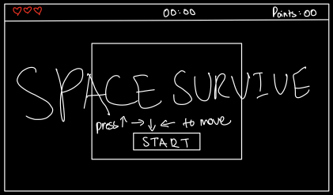

# Space Survive

Welcome to the **Spaceship Survival**! In this game, you control a spaceship trying to survive against enemies that chase you. The objective is to avoid collisions with enemies while collecting points to upgrade your ship.

## Features

- **Player Control:** Move your spaceship with the mouse.
- **Enemies:** Avoid enemy spaceships that track your position.
- **Lives:** Start with a limited number of lives.
- **Score System:** Earn points for survival time and upgrade your ship.
- **Win Condition:** Survive for 10 minutes to win the game.
- **Game Over:** Lose all lives to end the game.

## Game Controls

- **Start Game:** Click the "Start" button to begin.
- **Mouse Movement:** Move the mouse to control the spaceship's position.
- **Upgrade Lives:** Click the upgrade button when you have enough points.
- **Game Over:** Click the "Restart" button to play again after losing all lives.

## Game Mechanics

1. The player moves the spaceship using the mouse.
2. Enemies spawn and move towards the player.
3. The player loses a life if colliding with an enemy.
4. Points are gained for every 30 seconds survived.
5. Win by surviving for 10 minutes; lose if all lives are lost.

## Game Objectives

- **Survive:** The primary goal is to survive as long as possible while avoiding enemy spaceships.
- **Score Points:** Gain points by surviving time increments (every 30 seconds).
- **Upgrade Lives:** Use points to upgrade your lives for better chances of survival.

## And this is how the idea started...

## GAME SKETCH
### Start Page

### In-Game Page

### Game Over Page

## User Stories

1. **As a player**, I want to start the game so that I can begin playing.
2. **As a player**, I want to see my lives, score, and time survived displayed on the screen, so I can track my progress.
3. **As a player**, I want the enemies to move towards my mouse cursor, adding challenge to the game.
4. **As a player**, I want to be able to upgrade my lives when I score enough points, allowing me to survive longer.
5. **As a player**, I want to see a game-over screen when I run out of lives, so I know the game has ended.
6. **As a player**, I want to see a win screen if I survive for 10 minutes, giving me a sense of achievement.
7. **As a player**, I want to be able to restart the game after losing or winning, so I can play again.

## The Game Link
https://yusufhj.github.io/space_survive/