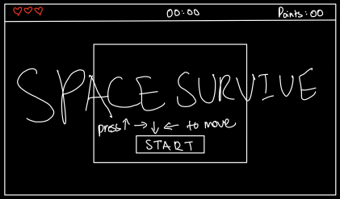
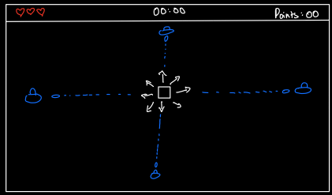
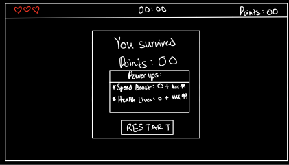

# This is how the idea started...

## GAME SKETCH
### Start Page


### In-Game Page


### Game Over Page



## USER STORIES

1. **Game Star**t: As a player, I navigate to the game interface and click the "Start Game" button to begin playing.
2. **Character Movement**: As a player, I use the arrow keys to move the rectangular spaceship around the grid, avoiding enemy laser bullets.
3. **Enemy Spawning**: As a player, I notice enemy spaceships spawn at random locations on the grid every 5 seconds, requiring me to adjust my movement strategy.
4. **Laser Shooting**: As a player, I see enemy spaceships shoot laser bullets toward my position at regular intervals, making it crucial for me to stay alert and dodge the incoming shots.
5. **Survival Time Tracking**: As a player, I keep an eye on the timer displaying how long I have survived, knowing that I will earn points based on my survival time.
6. **Point System**: As a player, I receive 1 point for every 30 seconds of survival, which is reflected in the score displayed at the top of the screen.
7. **Health Management**: As a player, I start with 1 health point, which decreases when I get hit by enemy laser bullets.
8. **Game Over Experience**: As a player, when I lose all my health, I see a game-over screen displaying my total score and the option to restart or exit the game.
9. **Upgrades After Game Over**: As a player, after the game ends, I have the option to upgrade my speed or health (lives) using the points I earned during the game, with a maximum of 99 upgrades for each category.
10. **Game UI Display**: As a player, I see my total score, the survival time, and the number of lives prominently displayed at the top of the page throughout the game, allowing me to track my progress easily.


## Pseudocode Plan

### **HTML Structure**
* **Start Button**:
    * A start button that will initiate the game when clicked
    * Appears in the center of the screen at first and disappear once the game starts (clicked).
* **Canvas for the Game display**:
    * This is where the game (player, enemy spaceships, lasers) will be rendered.
* **Nav Bar for Stats**:
    * Displayed at the top of the screen that shows the player's stats:
        * Score (Points)
        * Time Survived
        * Player Health (Lives <3)
        * Speed level


### **CSS Styling**
* **Space Environment**:
    * A background of a space theme
* **Player and Shooter Styles**:
    * The player as a small rectangle
    * The enemy Spaceships as simple circlar and oval shape as a spaceship with different colors.
* **Laser Shots**:
    * The laser shooters will be in an oval shape, with animations to move in a direction.
* **Responsive Layout**:
    * The canvas should be centered and the nav bar is positioned above the game.


### **JavaScript Game Logic**

#### **Initialization**:

* **Defining Constants and Variables**:
    * Setting up the constants of maximum lives, max speed, and time intervals, (maybe: enemy spawn rate, shooting rate).
    * Define variables for the state:
        * lives (initailized 1)
        * speed (initailized 1)
        * score (initailized 0)
        * timeSurvived (initailized 0)
        * (maybe) isGameRunning (to track whether the game is running or paused)
    * Store the player's position (x,y) and speed

* **Cache DOM Elements**:
    * Cache the start button, canvas, nav barr, and stat elements (score, time, health, speed) for updates.


#### **Game Flow**:

* **Start Button Event Listener**:
    * When the Start Button is clicked:
        * Hide the Start Button.
        * Initialize/reset game stats
        * Begin the game loop

* **Player Movement**: 
    * Event listeners for arrow keys or WASD to move player within the canvas.
    * Adjusting the player's position according to the speed variable.
    * Ensure the player stays within the canvas boundaries.


#### **Enemy and Laser Logic**:

* **Enemy Spawning**:
    * Set a 5 sec interval to spawn enemy spaceships at random positions around the grid.
    * Store each spawned enemy in an array for tracking.

* **Laser Shooting**:
    * Each enemy should shoot a laser towards the player at regular intervals.
    * (maybe) Calculate the direction of the laser based on the player's current position.
    * Move the lasers toward the player in each frame and check for collisions.

#### **Collision Detection**:

* **Laser Hits**:
    * For each frame, check if any lasers intersect with the player's position (the rectangle x,y borders)
    * If the laser hits the player, reduce the lives variable by 1.
    * If lives reaches 0, trigger the Game Over sequence.


### **Scoring and Timing System**

* **Time Survived**:
    * Using JavaScript's setInterval to count the time for every second.
    * For every 30 seconds the player survives, increment the score by 1.
    * Update the time survived and score displayed in the nav bar.

* **Upgrades**:
    * After each game:
        * Allowing the player to spend points to increase their speed or add more lives.
        * Ensuring that there's a maximum of 5 upgrades for each attribute (speed or health) after each game.
        * Update the nav bar to reflect the upgraded stats.


### **Game Over**

* **Game Over Sequence**:
    * If lives == 0 :
        * Stop the game loop (enemy spaceships spawning and movement).
        * Display a "Game Over" message with the player's final score and time survived.
        * Show the "Play Again" button to allow the user to restart the game.

* **Restart Game**:
    * Reset all variables (lives, speed, score, time) to their initial values.
    * Clear the canvas of enemies and lasers.
    * When the player clicks "Play Again", restart the game loop from the beginning.


<!-- 
```
// Define constants and variables
// Define a constant for the player's rectangle size
// Define constants for the grid dimensions
// Define a constant for the enemy spawn rate (5 seconds)
// Define a constant for the laser bullet speed

// Define the app's state variables, but don't assign values to them
let player;                  // Variable for the player's rectangle object
let enemies;                 // Array to hold enemy spaceship objects
let bullets;                 // Array to hold bullet objects
let score;                   // Variable to keep track of the player's score
let lives;                   // Variable to track player's lives
let timeSurvived;           // Variable to track the time survived
let gameOver;               // Variable to check if the game is over

// Select and save (cache) elements in variables that need to be accessed in the JavaScript code more than once
const scoreDisplay = document.getElementById('score');      // Element to display the score
const livesDisplay = document.getElementById('lives');      // Element to display lives
const timeDisplay = document.getElementById('time');        // Element to display time
const gameCanvas = document.getElementById('gameCanvas');   // Element for the game area
const playAgainButton = document.getElementById('playAgain'); // Button to play again

// Add event listeners - use delegated event listeners to listen to multiple elements with a single listener
document.addEventListener('keydown', handleKeyPress);        // Event listener for player movement

// Invoke the init function used to initialize all state variables
function init() {
    player = createPlayer();          // Create the player object
    enemies = [];                     // Initialize the enemies array
    bullets = [];                     // Initialize the bullets array
    score = 0;                        // Initialize score
    lives = 1;                        // Set initial lives
    timeSurvived = 0;                // Initialize time survived
    gameOver = false;                // Reset game over status
    updateDisplays();                 // Update the displays with initial values
    startGameLoop();                 // Start the main game loop
}

// Invoke the primary render function that transfers all state variables to the DOM
function render() {
    clearCanvas();                    // Clear the game canvas
    drawPlayer(player);               // Draw the player on the canvas
    drawEnemies(enemies);             // Draw enemies on the canvas
    drawBullets(bullets);             // Draw bullets on the canvas
    updateDisplays();                 // Update the score, lives, and time displays
}

// Start the game loop
function startGameLoop() {
    setInterval(function() {
        if (!gameOver) {
            updateGame();             // Update game state (movement, collisions, etc.)
            render();                 // Render the game
        }
    }, 1000 / 60);                    // Run at ~60 FPS
}

// Update all state variables with the correct values depending on the user's choice
function updateGame() {
    movePlayer();                     // Move the player based on user input
    updateEnemies();                  // Update enemy positions and check shooting
    checkCollisions();                // Check for collisions between player and bullets
    updateScoreAndTime();             // Update score and time survived
}

// Wait for the user to click on a button
function handleKeyPress(event) {
    if (gameOver) return;              // Ignore input if the game is over

    switch (event.key) {
        case 'ArrowUp':
            movePlayerUp();            // Move player up
            break;
        case 'ArrowDown':
            movePlayerDown();          // Move player down
            break;
        case 'ArrowLeft':
            movePlayerLeft();          // Move player left
            break;
        case 'ArrowRight':
            movePlayerRight();         // Move player right
            break;
    }
}

// Check for collisions
function checkCollisions() {
    // Check if the player has collided with any bullets
    for (let bullet of bullets) {
        if (isColliding(player, bullet)) {
            lives -= 1;                // Decrease lives
            if (lives <= 0) {
                gameOver = true;        // Set game over flag
            }
        }
    }
}

// Render the game message to the DOM
function updateDisplays() {
    scoreDisplay.innerText = `Score: ${score}`;
    livesDisplay.innerText = `Lives: ${lives}`;
    timeDisplay.innerText = `Time: ${timeSurvived}`;
}

// Wait for the user to click the "Play Again" button
playAgainButton.addEventListener('click', function() {
    init();                           // Reset the game state
});

// Invoke the init function to reset all state variables to their initial values
init();                               // Start the game when the page loads
```

The development will start with the html page, having a start button and the display of the game in the background. The CSS will handle the space environment and the player/shooter shapes. And the JavaScript will handle the movement, the game logic:
(
    if the laser shot hits the player, decrease the lives of the player, if the lives == 0 then game over. 
    for every 30 seconds survived in the game, add one point.
    for each point the user can upgrade their health or speed.
    speed will make their movement faster and health will make them hande more laser hits (lives).
    the stats will be displayed up top as a nav bar: score, time survived, player health, and speed
) -->